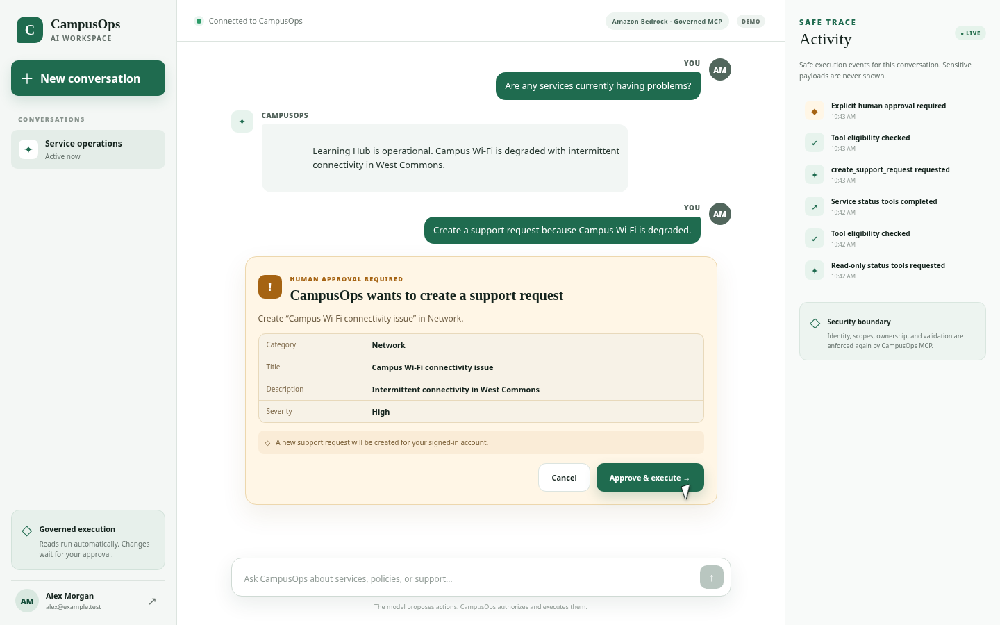
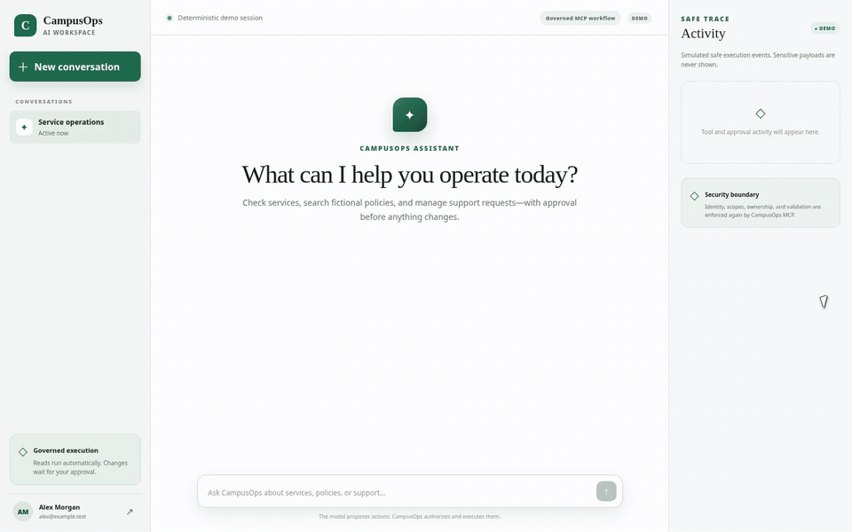

# CampusOps MCP Gateway

CampusOps MCP Gateway is a fictional enterprise Model Context Protocol (MCP) platform. Phase 1 established the local secure MCP foundation, Phase 2 added an AWS serverless production foundation, and Phase 3A adds an authenticated AI workspace with governed MCP tool use.

MCP is an open protocol that gives AI applications a standard way to discover and invoke tools, read contextual resources, and use reusable prompt templates. MCP does not replace application security: the model proposes a call, while this gateway validates and authorizes it.

No real university data or branding is used.

## Architecture

```text
Local: MCP client → HTTP/stdio → LocalJwtAuth → CampusOpsService → InMemory adapters

AWS:   Cognito → API Gateway JWT authorizer → Lambda MCP adapter
                                               ↓ Principal
                                          CampusOpsService
                                               ↓ interfaces
               ┌───────────────────────────────┼──────────────────────────────┐
        InMemory policies            DynamoDB operations             DynamoDB audit

Phase 3A: Browser → Next.js BFF session → Bedrock Converse → deterministic tool policy
                   │                                           │
                   └── Cognito PKCE              read: execute │ write: approve first
                                                               ▼
                                              authenticated MCP client → AWS path above
```

The monorepo uses pnpm workspaces:

- `apps/mcp-server`: HTTP/stdio entrypoints, MCP adapter, application services, repository interfaces/in-memory adapters, fictional data, and tests.
- `apps/mcp-client`: v2 SDK client and end-to-end MCP contract tests.
- `apps/workspace`: Next.js authenticated UI and server-side Cognito, session, chat, and approval routes.
- `packages/ai`: Bedrock provider boundary, MCP-schema tool translation, deterministic read/write policy, orchestration, approval state, and safe diagnostics.
- `packages/contracts`: shared Zod input schemas and domain contracts.
- `packages/auth`: signed local JWT issuer/verifier, principals, and scope checks.
- `packages/audit`: transport-independent audit event contract and in-memory sink.
- `packages/config`: validated local runtime configuration.
- `packages/aws`: validated AWS configuration and AWS client construction.
- `infrastructure`: Terraform bootstrap, reusable modules, and the dev environment.
- `docs`: architecture, MCP design, threat model, and decision records.

Business logic never lives in transport setup or directly in the registration callbacks. `Dependencies` references only the `PolicyRepository`, `ServiceRepository`, and `SupportRequestRepository` interfaces; `createDependencies()` selects their `InMemory*Repository` Phase 1 adapters. Tools and all five resources therefore follow the same transport → adapter → application service → repository interface → adapter path. Persistent adapters can replace them without changing MCP contracts or application behavior.

## MCP surface

| Kind     | Name                           | Required scope   | Security behavior                       |
| -------- | ------------------------------ | ---------------- | --------------------------------------- |
| Tool     | `search_policies`              | `policies:read`  | Read-only, bounded query and limit      |
| Tool     | `get_service_status`           | `services:read`  | Read-only                               |
| Tool     | `list_support_requests`        | `requests:read`  | Derives user from principal             |
| Tool     | `get_support_request`          | `requests:read`  | Enforces ownership                      |
| Tool     | `create_support_request`       | `requests:write` | User-scoped idempotency key             |
| Tool     | `cancel_support_request`       | `requests:write` | Enforces ownership                      |
| Resource | `policy://catalog`             | `policies:read`  | Catalog metadata                        |
| Resource | `policy://categories/security` | `policies:read`  | Fictional security policies             |
| Resource | `services://catalog`           | `services:read`  | Fictional service status                |
| Resource | `support://categories`         | `requests:read`  | Allowed categories                      |
| Resource | `platform://capabilities`      | none             | Public capability summary               |
| Prompt   | `triage-support-request`       | `requests:read`  | Treats supplied issue text as untrusted |
| Prompt   | `policy-answer`                | `policies:read`  | Requires evidence and policy IDs        |

Prompts are guidance, not privileged execution. They cannot bypass tool handlers.

## Authorization

HTTP requests require a signed bearer JWT. The local implementation is JWT-compatible and deliberately small: it validates signature, issuer, expiry, subject (`userId`), session ID, and an allow-listed scope array. It is an abstraction behind `TokenVerifier`, so a future OAuth/OIDC verifier can replace it.

Available scopes are `policies:read`, `services:read`, `requests:read`, `requests:write`, and `admin:audit`. The HTTP boundary authenticates once. Every application operation then authorizes independently; user identity is never a support-tool argument. Ownership is checked after locating a support request and before returning or changing it. Ownership denials are audited as denied authorization with `denialReason: "ownership"`; scope denials use `denialReason: "scope"`.

`JWT_SECRET` must be at least 32 characters. Development and test may use the checked-in local fallback. Production fails closed unless `JWT_SECRET` is explicitly supplied, and it rejects the development fallback even when explicitly configured.

## Audit system

Executable tools, resource reads, and prompt retrievals pass through a common audit wrapper. It records `eventId`, `traceId`, `userId`, `sessionId`, action, operation/tool name, authorization decision, optional scope/ownership denial reason, required scopes, duration, result, and timestamp on success, denial, or error. It intentionally omits tool arguments, descriptions, policy bodies, token values, and result payloads. The Phase 1 sink is in-memory and implements a replaceable `AuditSink` interface.

MCP-facing errors are normalized. Missing and cross-user support records both return `Resource not found or unavailable`, preventing ownership probing. Expected authorization and conflict failures use bounded public messages; unexpected internal exception names and messages are never returned to callers.

## Run locally

Requirements: Node.js 20+ and pnpm 10+.

```bash
pnpm install
pnpm build
JWT_SECRET='replace-with-a-local-secret-at-least-32-characters' pnpm dev:server
```

The HTTP endpoint is `http://127.0.0.1:3000/mcp`. A client must supply `Authorization: Bearer <signed-local-token>`. For local MCP hosts that spawn a process, run the stdio adapter:

```bash
pnpm --filter @campusops/mcp-server stdio
```

The stdio adapter uses the same server factory, application service, repositories, authorization checks, and audit sink. Its fixed development principal is suitable only for local testing.

Runtime mode is explicit: local entrypoints use `CAMPUSOPS_RUNTIME=local` semantics and `LocalJwtAuth`; Lambda requires `CAMPUSOPS_RUNTIME=aws`, Cognito/API Gateway identity, DynamoDB table names, region, environment, and an exact comma-separated `ALLOWED_ORIGINS`. AWS mode does not use or require `JWT_SECRET`.

## AWS mode

Phase 2 provisions Cognito authorization-code/PKCE authentication with Terraform-managed default managed-login branding, an API Gateway HTTP API JWT authorizer, stateless Lambda MCP execution, on-demand DynamoDB operational/audit tables, finite-retention CloudWatch logs, dashboard/alarms, and separate least-privilege runtime/deployment IAM roles. External `campusops/*.read|write` OAuth scopes map explicitly to the unchanged internal scopes. API Gateway requires at least one CampusOps scope on either MCP route; `CampusOpsService` still authorizes every tool, resource, and prompt exactly and enforces record ownership.

Support-request and service repositories are durable DynamoDB adapters. Idempotency uses a conditional transaction to atomically create the fingerprint record and request; concurrent losers consistently reread the winner. Audit events are append-only writes to a separate table and never contain MCP payloads or credentials. Policy retrieval intentionally remains `InMemoryPolicyRepository` until the Phase 3 knowledge architecture.

Build the deterministic Lambda artifact with `pnpm build:lambda`; that command builds all workspace dependencies first and is safe from a clean checkout. Terraform is organized under `infrastructure/modules`, with an operator-owned bootstrap for S3 state and GitHub OIDC/deployment IAM plus a separate dev application state using native S3 lockfiles. The manual **Deploy dev** GitHub workflow runs through the protected `dev` environment and assumes the narrowly scoped AWS role—never permanent AWS access-key secrets. See [AWS architecture](docs/aws-architecture.md), [AWS security](docs/aws-security.md), and [deployment](docs/deployment.md).

## Phase 3A AI workspace

The model proposes actions. CampusOps authorizes and executes them. The browser signs in through the existing public Cognito client using Authorization Code + PKCE, but receives only opaque, HttpOnly workspace cookies. OAuth state, PKCE verifier, access token, conversation state, and approval proposals remain server-side and in memory. SameSite cookies plus a per-session CSRF token protect state-changing workspace routes; token expiry invalidates the session.

### Governed AI Workspace



The model may request actions, but CampusOps controls authorization and execution. Read-only operations can run after authorization; state-changing operations require explicit human approval.



[Watch the longer MP4 demonstration](docs/demo/campusops-governed-tool-flow.mp4). The public media uses a deterministic presentation fixture with fictional identity and operations; it does not contain a live login, token, AWS identifier, or production payload. See [demo capture notes](docs/demo/README.md).

The workspace server invokes Amazon Bedrock Converse through a provider boundary and exposes only MCP tools allowed by the token's mapped scopes. Tool definitions are translated from the existing Zod contracts. Read-only tools execute automatically through the authenticated MCP client. State-changing operations require explicit human approval in the workspace:

| Policy                                  | Tools                                                                                   |
| --------------------------------------- | --------------------------------------------------------------------------------------- |
| Automatic after CampusOps authorization | `search_policies`, `get_service_status`, `list_support_requests`, `get_support_request` |
| Explicit approval                       | `create_support_request`, `cancel_support_request`                                      |

An approval is a random, expiring, single-use server record bound to the Cognito subject, workspace session, conversation, model tool-use ID, exact tool, and canonical argument fingerprint. The browser submits only the approval ID and decision; it cannot replace the stored operation. Approved execution still traverses API Gateway, Lambda, `CampusOpsService`, ownership checks, validation, idempotency, and audit. Prompt instructions shape model behavior but confer no authority.

Run the workspace against the deployed dev identity and MCP environment with your short-lived AWS profile:

```bash
AWS_PROFILE=campusops-terraform AWS_REGION=us-west-2 pnpm dev:workspace
```

The helper reads Terraform outputs without hardcoding infrastructure identifiers and uses the configurable `BEDROCK_MODEL_ID` (default `amazon.nova-lite-v1:0`). Open `http://localhost:3000` and sign in. See [deployment](docs/deployment.md) for the complete flow and [architecture](docs/architecture.md) for trust boundaries.

## Validation and contract tests

```bash
pnpm lint
pnpm typecheck
pnpm test
pnpm build
pnpm test:contract
```

The contract suite starts an ephemeral local HTTP server and uses the official MCP v2 client to list tools/resources/prompts, read every resource, get a prompt, invoke every read-only tool, test create/cancel behavior, prove same-payload retries create once, reject conflicting payload reuse, and verify scope and ownership failures. Idempotency records are scoped by user and store a SHA-256 fingerprint over canonical `category`, `title`, `description`, and `severity` fields.

GitHub Actions runs the frozen-lockfile install, lint, typecheck, unit/integration tests, build, and dedicated contract suite for every pull request and push to `master` using Node 20 and pnpm 10.33.0.
Pull requests also run Terraform formatting, backend-free initialization, and validation; they never apply infrastructure.

## Protocol compatibility

The server uses the official split MCP TypeScript SDK v2 packages. `createMcpHandler` serves the modern protocol and its stateless 2025-era compatibility path from one registration factory and endpoint. See [ADR 003](docs/adr/003-mcp-version-compatibility.md).

## Future evolution

Phase 3B can move fictional policy retrieval to a governed knowledge architecture using Bedrock/RAG and add durable, user-scoped conversation storage. AgentCore Gateway, OpenSearch, Knowledge Bases, guardrails, and a hosted workspace runtime are intentionally not part of Phase 3A.

## Security considerations

Inputs are strict and bounded, scopes are least-privilege, side effects require explicit write permission, idempotency is user-scoped and payload-bound, ownership is enforced server-side with non-enumerating public errors, production JWT configuration fails closed, and audit payloads exclude sensitive content. MCP metadata is treated as untrusted presentation data rather than authority. See [the threat model](docs/threat-model.md) for attack-specific controls and residual risks.

## Current limitations

Lambda supports stateless MCP `POST /mcp`; authenticated `GET /mcp` returns 405 because SSE/server-initiated streams and sessionful MCP are not supported. The Phase 3A workspace is a local reference BFF: sessions, conversations, and pending approvals are process-local and disappear on restart. Bedrock uses on-demand inference. Phase 3A does not contain Bedrock Knowledge Bases, OpenSearch, RAG, AgentCore Gateway, or durable conversation storage.
